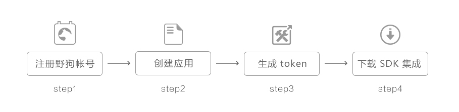
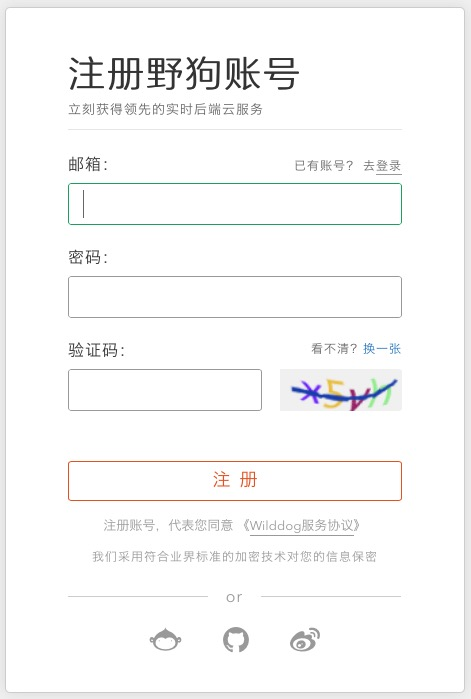
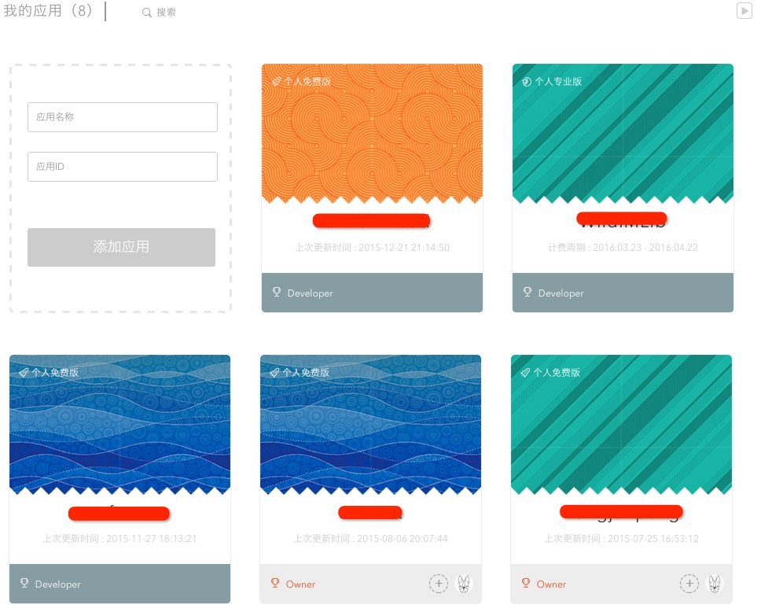
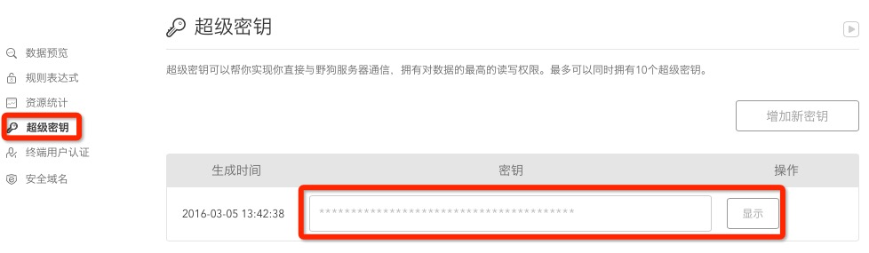

## 新手指引

####1 总览
开发者的应用接入野狗 IM SDK，需要经过如下几个简单的步骤:



####2 注册野狗实时后端云帐号

注册野狗实时后端云帐号请访问 [野狗注册页面](https://www.wilddog.com/my-account/signup)。



####3 创建应用

注册后登陆帐号，会进入野狗控制面板，在这里创业您的第一个应用。填入应用名和应用 ID，应用 ID 在初始化 SDK 时需要用到。,更多信息请访问 [如何创建野狗应用](https://z.wilddog.com/overview/app)




####4 生成 Token



App 开发都有自己的帐户系统，野狗使用 [JWT token](https://jwt.io) 结合超级密钥生成 Token 来集成 APP 用户 ID 和 昵称。在野狗帐号控制面板中进入应用中，在左侧功能栏中找到超级密钥。用户可以自行生成 token，只需符合格式约定。token 采用标准的 jwt 格式，payload部分中，必须包含的字段如下：[更多信息请参考文档](https://z.wilddog.com/rule/guide) 中第五节自定义 token。

| 字段 | 描述 |
| --- | --- |
| v | token 的版本，默认是数字 0  |
| iat | token 的颁发时间，Unix 时间秒数 |
| d | 认证数据。token 的 payload，必须包含 uid 字段，对应规则表达式中的 `auth` 变量|

下面是可选参数：

| 字段 | 描述 |
| --- | --- |
| nbf | token 在之前（缩写"not before"）时间不会生效|
| exp | token 过期的时间戳，以秒为单位 |
| admin | 如果设置为 true，将获得完全的读写权限|
| debug | 如果设置为 true，将在安全和规则表达式失败时提供详细的错误信息|


一个示例的 token payload：

``` 
{
    "v" : 0,
    "iat" : 1437520447,
    "d" : {
        "uid" : "sampleId"
    },
    "admin" : true,
    "exp" :  1437845927
}
```

使用 SHA-256 HMAC 签名，生成标准的 jwt 即可。


## WildIMLib iOS 集成

#### 使用 CocoaPods 
野狗建议使用 [CocoaPods](https://cocoapods.org/) 管理工程的依赖。关于 CocoaPods 的入门，请参考： [CocoaPods getting started](https://guides.cocoapods.org/using/getting-started.html)。 


打开工程目录，新建一个 Podfile 文件

	$ cd your-project-directory
	$ pod init
	$ open -a Xcode Podfile # opens your Podfile in XCode

然后在 Podfile 文件中添加以下语句

	target 'your-target-name' do
	pod 'Wilddog'
	pod 'WildChatLib'
	end
	
最后安装 SDK

	$ pod install
	$ open your-project.xcworkspace


####1 引入头文件

	#import <WildIMLib/WildIMSDK.h>
	
####2 初始化

WildIMLib 以野狗 SDK 为基础，所以初始化之前需要一个野狗的 AppID，通过 initSDK: 初始化。原型为：

````
/**
 *  初始化SDK
 *
 * @param sdkAppId    用户标识接入SDK的应用ID
 *
 *  @return 0 成功
 */
- (int)initSDK:(NSString *)sdkAppId;
 
```` 

######示例
	[[WildIMLib sharedInstance] initSDK:@"your-appid"];

####3 登陆

用户登陆野狗服务器后才能正常收发消息，登陆接口需要提供个 token，参考新手指引第四节生成 token。

######登陆结构原型
````
/**
 *  登陆
 *
 *  @param token  根据用户 ID、昵称和野狗超级密钥生成的 Token。
 *  @param succ   成功回调
 *  @param fail   失败回调
 *  @return 0 登陆请求发送成功，等待回调
 */
- (int)loginWithcustomeToken:(NSString *)token succ:(WildSucc)succ fail:(WildFail)fail;

````

######示例

````
[[WildManager sharedInstance] login:uid customeToken:token userName:uid succ:^{
                NSLog(@"login succ);              
            } fail:^(int code, NSString *msg) {
                NSLog(@"login failed:%@",msg);
            }];
````

####4 新消息通知
在多数情况下，用户需要感知新消息的通知，这时只需注册新消息通知回调 WildMessageListener，在用户登录状态下，会拉取离线消息，为了不漏掉消息通知，需要在登录之后注册新消息通知。

######原型

````
/**
 *  消息回调
 */
@protocol WildMessageListener <NSObject>

@required
/**
 *  新消息回调通知
 *
 *  @param msgs 新消息列表，WildMessage 类型数组
 */
- (void)onNewMessage:(NSArray*) msgs;
@end
````

####5 消息收发

#####a. 会话获取

会话是指面向一个人或者一个群组的对话，通过与单个人或群组之间会话收发消息，发消息时首先需要先获取会话，获取会话需要指定会话类型（群组&单聊），以及会话对方标志（对方帐号或者群号）。获取会话由 getConversation 实现：
######原型

````
/**
 *  获取会话
 *
 *  @param type 会话类型，Wild_C2C 表示单聊 Wild_GROUP 表示群聊
 *  @param receiver C2C 为对方用户 identifier， GROUP 为群组Id
 *
 *  @return 会话对象
 */
- (WildConversation *)getConversation:(WildConversationType)type receiver:(NSString *)receiver;
````
######参数说明
type：
会话类型，如果是单聊，填写 Wild_C2C，如果是群聊，填写 Wild_GROUP
receiver：
会话标识，单聊情况下，receiver 为对方帐号 identifier，群聊情况下，receiver 为群组 Id

######示例
以下示例获取对方 uid 为“10086”的单聊会话：

```
WildConversation * c2c_conversation = [[WildManager sharedInstance] getConversation:Wild_C2C receiver:@"10086"];
```
以下示例获取群组Id为"-KFS5puUyvyyDNsryJaY"的群聊会话：

```
WildConversation * group_conversation = [[WildManager sharedInstance] getConversation:Wild_GROUP receiver:@"-KFS5puUyvyyDNsryJaY"];
```

#####b. 消息发送

获取会话后，可以通过 sendMessage: 发送消息

######原型
````
@interface WildConversation : NSObject

-(int) sendMessage: (WildMessage*)msg succ:(WildSucc)succ fail:(WildFail)fail;

@end

````

#####5.1 文本消息发送
文本消息由 WildTextElem 定义：

```
@interface WildTextElem : WildElem {
    NSString * text;
}
```
text 传递需要发送的文本消息：
######示例

```
WildTextElem * text_elem = [[WildTextElem alloc] init];

[text_elem setText:@"this is a text message"];

WildMessage * msg = [[WildMessage alloc] init];
[msg addElem:text_elem];

[conversation sendMessage:msg succ:^(){
    NSLog(@"SendMsg Succ");
}fail:^(int code, NSString * err) {
    NSLog(@"SendMsg Failed:%d->%@", code, err);
}];

```
#####5.2 图片消息发送
图片消息由 WildImageElem 定义。它是 WildElem 的一个子类，也就是说图片也是消息的一种内容。 发送图片的过程，就是将 WildImageElem 加入到 WildMessage 中，然后随消息一起发送出去。详细如下：

######原型

```
/**
 *  存储要发送的图片路径，必须是本地路径，可参考下面示例
 */
@interface WildImageElem : WildElem

/**
 *  要发送的图片路径
 */
@property(nonatomic,retain) NSString * path;


/**
 *  图片压缩等级，详见 Wild_IMAGE_COMPRESS_TYPE
 */
@property(nonatomic,assign) Wild_IMAGE_COMPRESS_TYPE level;

@end
```
######参数说明
path ：存储要发送的图片路径，必须是本地路径，可参考下面示例

level : 发送图片前对图片进行压缩，level 表示压缩等级，详见 Wild_IMAGE_COMPRESS_TYPE 定义

发送图片时，只需要设置图片路径 path。

######图片发送示例：

```
/**
*  获取聊天会话, 以同用户iOS-001的单聊为例。
*/
WildConversation * c2c_conversation = [[WildManager sharedInstance] getConversation:Wild_C2C receiver:@"iOS-001"];

/**
*  构造一条消息
*/
WildMessage * msg = [[WildMessage alloc] init];

/**
*  构造图片内容
*/
WildImageElem * image_elem = [[WildImageElem alloc] init];
image_elem.path = @"/xxx/imgPath.jpg";

/**
*  将图片内容添加到消息容器中
*/
[msg addElem:image_elem];

/**
*  发送消息
*/
[conversation sendMessage:msg succ:^(){  //成功
       NSLog(@"SendMsg Succ");
}fail:^(int code, NSString * err) {  //失败
       NSLog(@"SendMsg Failed:%d->%@", code, err);
}];
```
##### 5.3 语音消息发送
语音消息由 WildSoundElem 定义，其中 data 存储语音数据，语音数据需要提供时长信息，以秒为单位，注意，一条消息只能有一个语音 Elem，添加多条语音 Elem 时，AddElem 函数返回错误1，添加不生效，另外，语音和文件 elem 不一定会按照添加时的顺序获取，建议逐个判断 elem 类型展示。

```
@interface WildSoundElem : WildElem {
   NSData * data;
   int second;
}
```
######示例

```
NSData *data = /* 语音数据 */;

WildSoundElem * sound_elem = [[WildSoundElem alloc] init];

[sound_elem setData:data];
[sound_elem setSecond:10];

WildMessage * msg = [[WildMessage alloc] init];
[msg addElem:sound_elem];

[conversation sendMessage:msg succ:^(){
    NSLog(@"SendMsg Succ");
}fail:^(int code, NSString * err) {
    NSLog(@"SendMsg Failed:%d->%@", code, err);
}];
```
###6 获取消息
ImSDK 会在本地进行消息存储，可通过 WildConversation 方法的 getMessage 获取，此方法为异步方法，需要通过设置回调得到消息数据，对于群组，登录后可以获取漫游消息，对于 C2C，开通漫游服务后可以获取漫游消息，ImSDK 提供了两种方式，一种通过闭包回调，另一种通过 protocol 接口回调：

######原型

```
@interface WildConversation : NSObject

// 闭包回调
- (int)getMessage:(int)count last:(WildMessage*)last succ:(WildGetMsgSucc)succ fail:(WildFail)fail;
```
######参数说明：
count 指定获取消息的数量

last 指定上次获取的最后一条消息，如果 last 传 nil，从最新的消息开始读取

succ 成功回调

fail 失败回调

######示例

```
[conversation getMessage:10 last:nil succ:^(NSArray * msgList) {
    for (WildMessage * msg in msgList) {
        if ([msg isKindOfClass:[WildMessage class]]) {
            NSLog(@"GetOneMessage:%@", msg);
        }
    }
}fail:^(int code, NSString * err) {
    NSLog(@"Get Message Failed:%d->%@", code, err);
}];
```

###7 获取所有会话
SDK 会保存用户的会话和消息，可以通过 ConversationCount 获取当前会话数量，从而得到所有本地会话：

######原型：

```
-(int) ConversationCount;
-(WildConversation*) getConversationByIndex:(int)index;

示例：

int cnt = [[WildManager sharedInstance] ConversationCount];

for (int i = 0; i < cnt; i++) {
 WildConversation * conversation = [[WildManager sharedInstance] getConversationByIndex:i];
}
```

###8 删除会话
存在本地的最近联系会话，可以删除，需要注意的是，此处仅删除会话记录，会话中的消息并未删除。

######原型

```
@interface TIMManager
/**
 *  删除会话
 *
 *  @param type 会话类型，Wild_C2C 表示单聊 Wild_GROUP 表示群聊
 *  @param receiver    用户 identifier 或者 群组 Id
 *
 *  @return TRUE:删除成功  FALSE:删除失败
 */
-(BOOL)deleteConversation:(WildConversationType)type receiver:(NSString*)receiver;

@end
```
######参数解释
type：

会话类型，如果是单聊，填写 Wild_C2C，如果是群聊，填写 Wild_GROUP

receiver：

会话标识，单聊情况下，receiver 为对方用户 identifier，群聊情况下，receiver 为群组 Id
######示例

```
WildConversation * conversation = [[WildManager sharedInstance] deleteConversation:Wild_C2C receiver:@"10086"];
```
###9 消息解析
收到消息后，可用过 getElem 从 WildMessage 中获取所有的 Elem 节点：

遍历 Elem 原型:

```
@interface WildMessage : NSObject

-(int) elemCount;
-(WildElem*) getElem:(int)index;

@end
```
######示例：

```
WildMessage * message = /* 消息 */

int cnt = [message elemCount];

for (int i = 0; i < cnt; i++) {
 WildElem * elem = [message getElem:i];

 if ([elem isKindOfClass:[WildTextElem class]]) {
     WildTextElem * text_elem = (WildTextElem * )elem;
 }
 else if ([elem isKindOfClass:[WildImageElem class]]) {
     WildImageElem * image_elem = (WildImageElem * )elem;
 }
}
```
###10 未读计数
#####10.1 获取当前未读消息数量
可通过 WildConversation 的 getUnReadMessageNum 方法获取当前会话中未读消息的数量：
######原型:

```
-(int) getUnReadMessageNum;
```
######示例

```
WildConversation * conversation = [[WildManager sharedInstance] getConversation:Wild_C2C receiver:@"iOS_002"];

[conversation getUnReadMessageNum];
```

#####10.2 已读上报

当用户阅读某个会话的数据后，需要进行会话消息的已读上报，SDK 根据会话中最后一条阅读的消息，设置会话中之前所有消息为已读。

######原型:

```
@interface WildConversation : NSObject

-(int) setReadMessage: (WildMessage*)readed;
-(int) setReadMessage;

@end
```
######参数说明
readed：

为当前会话中最后一条读过的消息，ImSDK会把比readed时间更早的消息标记为已读消息。无参数的版本设置一个会话中所有消息为已读状态，大多数情况下使用无参数版本即可。

######示例1

```
WildConversation * conversation = [[WildManager sharedInstance] getConversation:Wild_C2C receiver:@"iOS_002"];

WildMessage * msg = [[WildMessage alloc] init];
[conversation setReadMessage:msg];
```
此示例设置C2C会话内的所有消息为已读。
######示例2

```
WildConversation * conversation = [[WildManager sharedInstance] getConversation:Wild_GROUP receiver:@"TGID1JYSZEAEQ"];

[conversation setReadMessage];
```
此示例设置群组@"TGID1JYSZEAEQ"内所有消息为已读，C2C 和群组设置已读用法相同，区别在于会话类型。

###11 群组管理

群组消息与 C2C 消息相同，仅在获取 Conversation 时的会话类型不同， 创建群组相关操作由群管理器 WildGroupManager 管理，需在用户登录成功后操作。

######获取单例原型

```
@interface WildGroupManager : NSObject
+(WildGroupManager*)sharedInstance;
@end
```

createPrivateGroup 创建私有群，createPublicGroup 创建公有群,创建成功后返回群组 Id，可通过群组 Id 获取 Conversation 收发消息等。

######原型

```
@interface WildGroupManager : NSObject
/**
*  创建私有群
*/
- (int)createPrivateGroup:(NSArray*)members groupName:(NSString*)groupName succ:(WildCreateGroupSucc)succ fail:(WildFail)fail;
/**
*  创建公有群
*/
- (int)createPublicGroup:(NSArray*)members groupName:(NSString*)groupName succ:(WildCreateGroupSucc)succ fail:(WildFail)fail;

@end
```
######参数说明
members ： NSString 列表，指定加入群组的成员，创建者默认加入，无需指定（群内最多 500 人）

groupName ： NSString 类型，指定群组名称（最长 30 字节）

groupId : NSString 类型，指定群组 Id

succ ： 成功回调，返回群组 Id

fail ： 失败回调示例：

######示例

```
NSMutableArray * members = [[NSMutableArray alloc] init];
// 添加一个用户iOS_002
[members addObject:@"iOS_002"];
[[WildGroupManager sharedInstance] CreatePrivateGroup:members groupName:@"GroupName" succ:^(NSString * group) {
    NSLog(@"create group succ, sid=%@", group);
} fail:^(int code, NSString* err) {
    NSLog(@"failed code: %d %@", code, err);
}];
```
示例创建一个私有群组，并且把用户@"iOS_002"拉入群组，创建者默认加入群组，无需显式指定。
公有群和聊天室调用方式和参数相同，仅方法名不同。

####11.1 加用户入群

WildGroupManager 的接口 inviteGroupMember 可以拉人进入群组，此操作只对私有群有效。

权限说明：

只有私有群可以拉用户入群；

公有群和聊天室不能拉人入群；

######原型：

```
@interface WildGroupManager : NSObject
-(int)inviteGroupMember:(NSString*)group members:(NSArray*)members succ:(WildGroupMemberSucc)succ fail:(WildFail)fail;
@end
```
参数说明：

group ： NSString 类型，群组Id

members ： NSString 列表，加入群组用户列表

succ ： 成功回调，WildGroupMemberResult 数组，返回成功加入群组的用户列表以及成功状态

fail ： 失败回调

示例：

```
NSMutableArray * members = [[NSMutableArray alloc] init];
// 添加一个用户iOS_002
[members addObject:@"iOS_002"];
// @"TGID1JYSZEAEQ" 为群组Id
[[WildGroupManager sharedInstance] InviteGroupMember:@"TGID1JYSZEAEQ" members:members succ:^(NSArray* arr) {
    for (WildGroupMemberResult * result in arr) {
        NSLog(@"user %@ status %d", result.member, result.status);
    }
} fail:^(int code, NSString* err) {
    NSLog(@"failed code: %d %@", code, err);
}];
```
示例中邀请好友 @"iOS_002" 加入群组 Id @"TGID1JYSZEAEQ"，成功后返回操作列表以及成功状态。
其中 result.status 表示当前用户操作是否成功，具体定义如下：

```
/**
*  群组操作结果
*/
typedef NS_ENUM(NSInteger, WildGroupMemberStatus) {
    /**
    *  操作失败
    */
    Wild_GROUP_MEMBER_STATUS_FAIL              = 0,
    /**
    *  操作成功
    */
    Wild_GROUP_MEMBER_STATUS_SUCC              = 1,
    /**
    *  无效操作，加群时已经是群成员，移除群组时不在群内
    */
    Wild_GROUP_MEMBER_STATUS_INVALID           = 2,
};
```
#####11.2 申请加入群组

WildGroupManager 的接口 joinGroup 可以主动申请进入群组，此操作只对公有群和聊天室有效。

权限说明：

私有群不能由用户主动申请入群；

公有群可以主动申请进入；

如果群组设置为需要审核，申请后管理员和群主会受到申请入群系统消息，需要等待管理员或者群主审核，如果群主设置为任何人可加入，则直接入群成功。

原型：

```
@interface WildGroupManager : NSObject
/**
*  申请加群
*
*  @param group 申请加入的群组Id
*  @param msg   申请消息
*  @param succ  成功回调（申请成功等待审批）
*  @param fail  失败回调
*
*  @return 0 成功
*/
-(int)joinGroup:(NSString*)group msg:(NSString*)msg succ:(WildSucc)succ fail:(WildFail)fail;
@end
```
参数说明：

group ： NSString 类型，群组Id

msg ： 申请理由

succ ： 成功回调

fail ： 失败回调

######示例：

```
[[WildGroupManager sharedInstance] JoinGroup:@"TGID1JYSZEAEQ" msg:@"Apply Join Group" succ:^(){
    NSLog(@"Join Succ");
}fail:^(int code, NSString * err) {
    NSLog(@"code=%d, err=%@", code, err);
}];
```
示例中用户申请加入群组 @"TGID1JYSZEAEQ"，申请理由为 @"Apply Join Group"。6.6. 退出群组
群组成员可以主动退出群组。

权限说明：

对于私有群，全员可退出群组；
对于公有群和聊天室，群主不能退出；

######原型：

```
@interface WildGroupManager : NSObject
-(int)quitGroup:(NSString*)group succ:(WildSucc)succ fail:(WildFail)fail;
@end
```
######参数说明：

group ： NSString 类型，群组Id
succ ： 成功回调
fail ： 失败回调

######示例：

```
// @"TGID1JYSZEAEQ" 为群组Id
[[WildGroupManager sharedInstance] quitGroup:@"TGID1JYSZEAEQ" succ:^() {
    NSLog(@"succ");
} fail:^(int code, NSString* err) {
    NSLog(@"failed code: %d %@", code, err);
}];
```
示例中主动退出群组 @"TGID1JYSZEAEQ"。

####11.3 退出群组

群组成员可以主动退出群组。

权限说明：

对于私有群，全员可退出群组；
对于公有群和聊天室，群主不能退出；

######原型：

```
@interface WildGroupManager : NSObject
- (int)quitGroup:(NSString*)group succ:(WildSucc)succ fail:(WildFail)fail;
@end
```
######参数说明：

group ： NSString 类型，群组Id

succ ： 成功回调

fail ： 失败回调

######示例：

```
// @"TGID1JYSZEAEQ" 为群组Id
[[WildGroupManager sharedInstance] QuitGroup:@"TGID1JYSZEAEQ" succ:^() {
    NSLog(@"succ");
} fail:^(int code, NSString* err) {
    NSLog(@"failed code: %d %@", code, err);
}];
示例中主动退出群组 @"TGID1JYSZEAEQ"。
```
####11.4 删除群组成员

群组成员也可以删除其他成员，函数参数信息与加入群组相同。

权限说明：

对于私有群：只有创建者可删除群组成员
对于公有群和聊天室：只有管理员和群主可以踢人

######原型：

```
@interface WildGroupManager : NSObject
-(int)deleteGroupMember:(NSString*)group members:(NSArray*)members succ:(WildGroupMemberSucc)succ fail:(WildFail)fail;
@end
```
参数说明：

group ： NSString 类型，群组Id

members ： NSString* 数组，被操作的用户列表

succ ： 成功回调，WildGroupMemberResult 数组，返回成功加入群组的用户列表已经成功状态

fail ： 失败回调

######示例：

```
NSMutableArray * members = [[NSMutableArray alloc] init];

// 添加一个用户iOS_002
[members addObject:@"iOS_002"];

// @"TGID1JYSZEAEQ" 为群组Id
[[WildGroupManager sharedInstance] DeleteGroupMember:@"TGID1JYSZEAEQ" members:members succ:^(NSArray* arr) {
    for (WildGroupMemberResult * result in arr) {
        NSLog(@"user %@ status %d", result.member, result.status);
    }
} fail:^(int code, NSString* err) {
    NSLog(@"failed code: %d %@", code, err);
}];
```
示例中把好友 @"iOS_002" 从群组 @"TGID1JYSZEAEQ" 中删除，执行成功后返回操作列表以及操作状态。
result.status 含义参照 6.4 加用户入群。

####11.5 获取群成员列表

getGroupMembers 方法可获取群内成员列表。

权限说明：

任何群组类型都可以获取成员列表；

######原型：

```
/**
 *  成员操作返回值
 */
@interface WildGroupMemberInfo : NSObject

/**
 *  被操作成员
 */
@property(nonatomic,retain) NSString* member;
/**
 *  加入群组时间
 */
@property(nonatomic,assign) Wilde_t joinWilde;

/**
 *  成员类型
 */
@property(nonatomic,assign) WildGroupMemberRole role;

@end

@interface WildGroupManager : NSObject
-(int)getGroupMembers:(NSString*)group succ:(WildGroupMemberSucc)succ fail:(WildFail)fail;
@end

```
参数说明：

group ： NSString 类型，群组 Id

succ ： 成功回调（返回WildGroupMemberInfo *数组）

fail ： 失败回调

######示例：

```
// @"TGID1JYSZEAEQ" 为群组Id
[[WildGroupManager sharedInstance] GetGroupMembers:@"TGID1JYSZEAEQ" succ:^(NSArray* list) {
    for (WildGroupMemberInfo * info in list) {
        NSLog(@"user=%@ joinWilde=%lu role=%d", info.member, info.joinWilde, info.role);
    }
} fail:^(int code, NSString * err) {
    NSLog(@"failed code: %d %@", code, err);
}];
```
示例中获取群 @"TGID1JYSZEAEQ" 的成员列表，list 为 WildGroupMemberInfo * 数据，存储成员的相关信息。

####11.5 获取群组资料

getGroupInfo方法可以获取群组资料。

权限说明：

注意：获取群组资料接口只能由群成员调用，非群成员无法通过此方法获取资料。
群资料信息由 WildGroupInfo 定义：

```
@interface WildGroupInfo : NSObject {
    NSString*       group;          // 群组Id
    NSString*       groupName;      // 群名
    NSString*       groupType;      // 群组类型
    NSString*       owner;          // 创建人
    uint32_t        createWilde;     // 群创建时间
    uint32_t        lastInfoWilde;   // 最近一次修改资料时间
    uint32_t        lastMsgWilde;    // 最近一次发消息时间
    uint32_t        memberNum;      // 群成员数量
    NSString*       notification;      // 群公告
    NSString*       introduction;      // 群简介
    NSString*       faceURL;            // 群头像
}
```
通过 WildGroupManager 的方法 getGroupInfo 可获取群组资料：

######定义：

```
@interface WildGroupManager : NSObject
-(int)getGroupInfo:(NSArray*)groups succ:(WildGroupListSucc)succ fail:(WildFail)fail;
@end
```
参数说明：

groups ：NSString 数组，需要获取资料的群组列表

succ ： 成功回调，返回群组资料列表，WildGroupInfo数组

fail ： 失败回调

######示例：

```
NSMutableArray * groupList = [[NSMutableArray alloc] init];
[groupList addObject:@"TGID1JYSZEAEQ"];

[[WildGroupManager sharedInstance] GetGroupInfo:groupList succ:^(NSArray * groups) {
    for (WildGroupInfo * info in groups) {
        NSLog(@"get group succ, infos=%@", info);
    }
} fail:^(int code, NSString* err) {
    NSLog(@"failed code: %d %@", code, err);
}];
```
示例中获取群组 @"TGID1JYSZEAEQ" 的详细信息。

####11.6 修改群名

通过 modifyGroupName 可以修改群组名称：

权限说明：

对于公有群和聊天室，只有群主或者管理员可以修改群名；
对于私有群，任何人可修改群名；

######原型：

```
@interface WildGroupManager : NSObject
-(int)modifyGroupName:(NSString*)group groupName:(NSString*)groupName succ:(WildSucc)succ fail:(WildFail)fail;
@end
```
参数说明：

group ： 群组Id

groupName ： 修改后的群名

succ ： 成功回调

fail ： 失败回调

######示例：

```
[[WildGroupManager sharedInstance] modifyGroupName:@"TGID1JYSZEAEQ" groupName:@"ModifyGroupName" succ:^() {
    NSLog(@"modify group name succ");
}fail:^(int code, NSString* err) {
    NSLog(@"failed code: %d %@", code, err);
}];
```
示例修改群 @"TGID1JYSZEAEQ" 的名字为 @"ModifyGroupName"。

####11.7 修改群简介

通过 modifyGroupIntroduction可以修改群组简介：

权限说明：

对于公有群和聊天室，只有群主或者管理员可以修改群简介；
对于私有群，任何人可修改群简介；

######原型：

```
@interface WildGroupManager : NSObject

/**
 *  修改群简介
 *
 *  @param group            群组Id
 *  @param introduction     群简介
 *  @param succ             成功回调
 *  @param fail             失败回调
 *
 *  @return 0 成功
 */
-(int)modifyGroupIntroduction:(NSString*)group introduction:(NSString*)introduction succ:(WildSucc)succ fail:(WildFail)fail;

@end
```
参数说明：

group ： 群组Id

introduction ： 群简介，简介最长120字节

succ ： 成功回调

fail ： 失败回调

######示例：

```
[[WildGroupManager sharedInstance] modifyGroupIntroduction:@"TGID1JYSZEAEQ" introduction :@"this is one group" succ:^() {
    NSLog(@"modify group introduction succ");
}fail:^(int code, NSString* err) {
    NSLog(@"failed code: %d %@", code, err);
}];
```
####11.8 修改群公告

通过 modifyGroupNotification 可以修改群组公告：

权限说明：

对于公有群和聊天室，只有群主或者管理员可以修改群公告；
对于私有群，任何人可修改群公告；

######原型：

```
@interface WildGroupManager : NSObject

/**
 *  修改群公告
 *
 *  @param group            群组Id
 *  @param notification     群公告（最长150字节）
 *  @param succ             成功回调
 *  @param fail             失败回调
 *
 *  @return 0 成功
 */
-(int)modifyGroupNotification:(NSString*)group notification:(NSString*)notification succ:(WildSucc)succ fail:(WildFail)fail;

@end
```
参数说明：

group ： 群组Id

notification ： 群公告，群公告最长150字节

succ ： 成功回调

fail ： 失败回调

######示例：

```
[[WildGroupManager sharedInstance] modifyGroupNotification:@"TGID1JYSZEAEQ" notification:@"test notification" succ:^() {
    NSLog(@"modify group notification succ");
}fail:^(int code, NSString* err) {
    NSLog(@"failed code: %d %@", code, err);
}];
```
示例修改群 @"TGID1JYSZEAEQ" 的公告为 @"test notification"。

####11.9 修改群头像

通过 modifyGroupFaceUrl可以修改群头像：

权限说明：

对于公有群和聊天室，只有群主或者管理员可以修改群头像；
对于私有群，任何人可修改群头像；

######原型：

```
/**
 *  修改群头像
 *
 *  @param group            群组Id
 *  @param url              群头像地址（最长100字节）
 *  @param succ             成功回调
 *  @param fail             失败回调
 *
 *  @return 0 成功
 */
-(int) ModifyGroupFaceUrl:(NSString*)group url:(NSString*)url succ:(WildSucc)succ fail:(WildFail)fail;

@end
```
参数说明：

group ： 群组Id

url： 群头像地址（最长100字节）

succ ： 成功回调

fail ： 失败回调

######示例：

```
[[WildGroupManager sharedInstance] modifyGroupFaceUrl:@"TGID1JYSZEAEQ" notification:@"http://test/x.jpg" succ:^() {
    NSLog(@"modify group face url succ");
}fail:^(int code, NSString* err) {
    NSLog(@"failed code: %d %@", code, err);
}];
```
####11.10 解散群组

通过 deleteGroup 可以解散群组。

权限说明：

对于私有群，任何人都无法解散群组
对于公有群和聊天室，群主可以解散群组：

######原型：

```
@interface WildGroupManager : NSObject

/**
 *  解散群组
 */
-(int)deleteGroup:(NSString*)group succ:(WildSucc)succ fail:(WildFail)fail;

@end
```
参数说明：

group ： 群组Id

succ ： 成功回调，返回群组Id列表，NSString数组

fail ： 失败回调

######示例：

```
[[WildGroupManager sharedInstance] deleteGroup:@"TGID1JYSZEAEQ" succ:^() {
    NSLog(@"delete group succ");
}fail:^(int code, NSString* err) {
    NSLog(@"failed code: %d %@", code, err);
}];
```
示例中解散群组 @"TGID1JYSZEAEQ"。

###12 群事件消息

当有用户被邀请加入群组，或者有用户被移出群组时，群内会产生有提示消息，调用方可以根据需要展示给群组用户，或者忽略。提示消息使用一个特殊的 Elem 标识，通过新消息回调返回：

如下图中，展示一条修改群名的事件消息：


######消息原型：

```
/**
 *  群Tips类型
 */
typedef NS_ENUM(NSInteger, Wild_GROUP_TIPS_TYPE){
    /**
     *  邀请加入群 (opUser & groupName & userList)
     */
    Wild_GROUP_TIPS_TYPE_INVITE              = 0x01,
    /**
     *  退出群 (opUser & groupName & userList)
     */
    Wild_GROUP_TIPS_TYPE_QUIT_GRP            = 0x02,
    /**
     *  踢出群 (opUser & groupName & userList)
     */
    Wild_GROUP_TIPS_TYPE_KICKED              = 0x03,
    /**
     *  设置管理员 (opUser & groupName & userList)
     */
    Wild_GROUP_TIPS_TYPE_SET_ADMIN           = 0x04,
    /**
     *  取消管理员 (opUser & groupName & userList)
     */
    Wild_GROUP_TIPS_TYPE_CANCEL_ADMIN        = 0x05,
    /**
     *  群资料变更 (opUser & groupName & introduction & notification & faceUrl & owner)
     */
    Wild_GROUP_TIPS_TYPE_INFO_CHANGE         = 0x06,
    /**
     *  群成员资料变更 (opUser & groupName & memberInfoList)
     */
    Wild_GROUP_TIPS_TYPE_MEMBER_INFO_CHANGE         = 0x07,
};
```

```

/**
 *  群Tips
 */
@interface WildGroupTipsElem : WildElem

/**
 *  群Tips类型
 */
@property(nonatomic,assign) Wild_GROUP_TIPS_TYPE type;

/**
 *  操作人用户名
 */
@property(nonatomic,retain) NSString * opUser;

/**
 *  被操作人列表 NSString* 数组
 */
@property(nonatomic,retain) NSArray * userList;

/**
 *  在群名变更时表示变更后的群名，否则为 nil
 */
@property(nonatomic,retain) NSString * groupName;

/**
 *  群信息变更： Wild_GROUP_TIPS_TYPE_INFO_CHANGE 时有效，为 WildGroupTipsElemGroupInfo 结构体列表
 */
@property(nonatomic,retain) NSArray * groupChangeList;

/**
 *  成员变更： Wild_GROUP_TIPS_TYPE_MEMBER_INFO_CHANGE 时有效，为 WildGroupTipsElemMemberInfo 结构体列表
 */
@property(nonatomic,retain) NSArray * memberChangeList;

/**
 *  操作者用户资料
 */
@property(nonatomic,retain) WildUserProfile * opUserInfo;
/**
 *  操作者群成员资料
 */
@property(nonatomic,retain) WildGroupMemberInfo * opGroupMemberInfo;
/**
 *  变更成员资料
 */
@property(nonatomic,retain) NSDictionary * changedUserInfo;
/**
 *  变更成员群内资料
 */
@property(nonatomic,retain) NSDictionary * changedGroupMemberInfo;

@end
```
调用方可选择是否予以展示，以及如何展示。

######示例：

```
@interface WildMessageListenerImpl : NSObject

- (void)onNewMessage:(NSArray*) msgs;

@end

@implementation WildMessageListenerImpl
- (void)onNewMessage:(NSArray*) msgs {
    for (WildMessage * msg in msgs) {
        WildConversation * conversation = [msg getConversation];

        for (int i = 0; i < [msg elemCount]; i++) {
            WildElem * elem = [msg getElem:i];
            if ([elem isKindOfClass:[WildGroupTipsElem class]]) {
                WildGroupTipsElem * tips_elem = (WildGroupTipsElem * )elem;
                switch ([tips_elem type]) {
                    case Wild_GROUP_TIPS_TYPE_INVITE:
                        NSLog(@"invite %@ into group %@", [tips_elem userList], [conversation getReceiver]);
                        break;
                    case Wild_GROUP_TIPS_TYPE_QUIT_GRP:
                        NSLog(@"%@ quit group %@", [tips_elem userList], [conversation getReceiver]);
                        break;
                    default:
                        NSLog(@"ignore type");
                        break;
                }
            }
        }
    }
}
@end

WildMessageListenerImpl * impl = [[WildMessageListenerImpl alloc] init];

[[WildManager sharedInstance] initSdk];

[[WildManager sharedInstance] setMessageListener:impl];

[[WildManager sharedInstance] login:@"your-token" succ:^(){
    NSLog(@"login succ");
} fail:^(int code, NSString * err) {
    NSLog(@"login failed: %d->%@", code, err);
}];
```
示例中注册新消息回调，打印用户进入群组和离开群组的事件通知，其他事件通知用法相同，具体含义可参见下面章节：

####12.1 用户被邀请加入群组

触发时机：当有用户被邀请加入群组时，群组内会由系统发出通知，开发者可选择展示样式。可以更新群成员列表。

收到的消息type为 Wild_GROUP_TIPS_TYPE_INVITE。

WildGroupTipsElem 参数说明：

type： Wild_GROUP_TIPS_TYPE_INVITE

opUser ： 邀请人

groupName ： 群名

userList ： 被邀请入群的用户列表

####12.2 用户退出群组

触发时机：当有用户主动退群时，群组内会由系统发出通知。可以选择更新群成员列表。
收到的消息type为 Wild_GROUP_TIPS_TYPE_QUIT_GRP。

WildGroupTipsElem 参数说明：

type： Wild_GROUP_TIPS_TYPE_QUIT_GRP

opUser ： 退出用户identifier

groupName ： 群名

####12.3 用户退出群组

触发时机：当有用户主动退群时，群组内会由系统发出通知。可以选择更新群成员列表。
收到的消息type为 Wild_GROUP_TIPS_TYPE_QUIT_GRP。

WildGroupTipsElem 参数说明：

type： Wild_GROUP_TIPS_TYPE_QUIT_GRP

opUser ： 退出用户identifier

groupName ： 群名

####12.4 被设置/取消管理员

触发时机：当有用户被设置为管理员或者被取消管理员身份时，群组内会由系统发出通知。如果界面有显示是否管理员，此时可更新管理员标识。
收到的消息type为 Wild_GROUP_TIPS_TYPE_SET_ADMIN 和 Wild_GROUP_TIPS_TYPE_CANCEL_ADMIN 。

WildGroupTipsElem 参数说明： 

type： 设置：Wild_GROUP_TIPS_TYPE_SET_ADMIN

取消：Wild_GROUP_TIPS_TYPE_CANCEL_ADMIN

opUser ： 操作用户identifier

groupName ： 群名

userList ： 被设置/取消管理员身份的用户列表

####12.5 群资料变更

触发时机：当群资料变更，如群名、群简介等，会有系统消息发出，可更新相关展示字段。或者选择性把消息展示给用户。

WildGroupTipsElem 参数说明：

type： Wild_GROUP_TIPS_TYPE_INFO_CHANGE

opUser ： 操作用户identifier

groupName ： 群名

groupChangeInfo： 群变更的具体资料信息，为WildGroupTipsElemGroupInfo 结构体列表

WildGroupTipsElemGroupInfo 

######原型：

```
/**
 *  群tips，群变更信息
 */
@interface WildGroupTipsElemGroupInfo : NSObject

/**
 *  群名，如果没有变更，为 nil
 */
@property(nonatomic,retain) NSString * groupName;

/**
 *  群简介： 没有变更时为 nil
 */
@property(nonatomic,retain) NSString * introduction;

/**
 *  群公告： 没有变更时为 nil
 */
@property(nonatomic,retain) NSString * notification;

/**
 *  群头像： 没有变更时为 nil
 */
@property(nonatomic,retain) NSString * faceUrl;

/**
 *  群主： 没有变更时为 nil
 */
@property(nonatomic,retain) NSString * owner;

@end
```
参数说明：
groupName： 变更后的群名，如果没有变更则为nil

introduction： 变更后的群简介，如果没有变更则为nil

notification： 变更后的群公告，如果没有变更则为nil

faceUrl： 变更后的群头像URL，如果没有变更则为nil

owner： 变更后的群主，如果没有变更则为nil

####12.6 群成员资料变更

触发时机：当群成员的群相关资料变更时，会有系统消息发出，可更新相关字段展示，或者选择性把消息展示给用户。（注意：这里的资料仅跟群相关资料，比如禁言时间、成员角色变更等，不包括用户昵称等本身资料）。

WildGroupTipsElem 参数说明：

type： Wild_GROUP_TIPS_TYPE_MEMBER_INFO_CHANGE

opUser ： 操作用户identifier

groupName ： 群名

memberInfoList： 变更的群成员的具体资料信息，为WildGroupTipsElemMemberInfo结构体列表

WildGroupTipsElemMemberInfo 

######原型：

```
/**
 *  群tips，成员变更信息
 */
@interface WildGroupTipsElemMemberInfo : NSObject

/**
 *  变更用户
 */
@property(nonatomic,retain) NSString * identifier;
/**
 *  禁言时间（秒，还剩多少秒可以发言）
 */
@property(nonatomic,assign) uint32_t shutupWilde;

@end
参数说明：

identifier： 变更的用户identifier
shutupWilde： 被禁言的时间
```
###13 群系统消息

当有用户申请加群等事件发生时，管理员会收到邀请加群系统消息，用户可根据情况接受请求或者拒绝，相应的消息通过群系统消息展示给用户。
群系统消息类型定义：

```
/**
 *  群系统消息类型
 */
typedef NS_ENUM(NSInteger, Wild_GROUP_SYSTEM_TYPE){
    /**
     *  申请加群请求（只有管理员会收到）
     */
    Wild_GROUP_SYSTEM_ADD_GROUP_REQUEST_TYPE              = 0x01,
    /**
     *  申请加群被同意（只有申请人能够收到）
     */
    Wild_GROUP_SYSTEM_ADD_GROUP_ACCEPT_TYPE               = 0x02,
    /**
     *  申请加群被拒绝（只有申请人能够收到）
     */
    Wild_GROUP_SYSTEM_ADD_GROUP_REFUSE_TYPE               = 0x03,
    /**
     *  被管理员踢出群（只有被踢的人能够收到）
     */
    Wild_GROUP_SYSTEM_KICK_OFF_FROM_GROUP_TYPE            = 0x04,
    /**
     *  群被解散（全员能够收到）
     */
    Wild_GROUP_SYSTEM_DELETE_GROUP_TYPE                   = 0x05,
    /**
     *  创建群消息（创建者能够收到）
     */
    Wild_GROUP_SYSTEM_CREATE_GROUP_TYPE                   = 0x06,
    /**
     *  邀请加群（被邀请者能够收到）
     */
    Wild_GROUP_SYSTEM_INVITED_TO_GROUP_TYPE               = 0x07,
    /**
     *  主动退群（主动退群者能够收到）
     */
    Wild_GROUP_SYSTEM_QUIT_GROUP_TYPE                     = 0x08,
    /**
     *  设置管理员(被设置者接收)
     */
    Wild_GROUP_SYSTEM_GRANT_ADMIN_TYPE                    = 0x09,
    /**
     *  取消管理员(被取消者接收)
     */
    Wild_GROUP_SYSTEM_CANCEL_ADMIN_TYPE                   = 0x0a,
    /**
     *  群已被回收(全员接收)
     */
    Wild_GROUP_SYSTEM_REVOKE_GROUP_TYPE                   = 0x0b,
    /**
     *  邀请入群请求(被邀请者接收)
     */
    Wild_GROUP_SYSTEM_INVITE_TO_GROUP_REQUEST_TYPE        = 0x0c,
    /**
     *  邀请加群被同意(只有发出邀请者会接收到)
     */
    Wild_GROUP_SYSTEM_INVITE_TO_GROUP_ACCEPT_TYPE         = 0x0d,
    /**
     *  邀请加群被拒绝(只有发出邀请者会接收到)
     */
    Wild_GROUP_SYSTEM_INVITE_TO_GROUP_REFUSE_TYPE         = 0x0e,
 };
```

```

/**
 *  群系统消息
 */
@interface WildGroupSystemElem : WildElem

/**
 * 操作类型
 */
@property(nonatomic,assign) Wild_GROUP_SYSTEM_TYPE type;

/**
 * 群组Id
 */
@property(nonatomic,retain) NSString * group;

/**
 * 操作人
 */
@property(nonatomic,retain) NSString * user;

/**
 * 操作理由
 */
@property(nonatomic,retain) NSString * msg;


/**
 *  消息标识，客户端无需关心
 */
@property(nonatomic,assign) uint64_t msgKey;

/**
 *  消息标识，客户端无需关心
 */
@property(nonatomic,retain) NSData * authKey;

/**
 *  操作人资料
 */
@property(nonatomic,retain) WildUserProfile * opUserInfo;

/**
 *  操作人群成员资料
 */
@property(nonatomic,retain) WildGroupMemberInfo * opGroupMemberInfo;

/**
 *  同意申请，目前只对申请加群和被邀请入群消息生效
 *
 *  @param msg  同意理由，选填
 *  @param succ 成功回调
 *  @param fail 失败回调，返回错误码和错误描述
 */
- (void) accept:(NSString*)msg succ:(WildSucc)succ fail:(WildFail)fail;

/**
 *  拒绝申请，目前只对申请加群和被邀请入群消息生效
 *
 *  @param msg  拒绝理由，选填
 *  @param succ 成功回调
 *  @param fail 失败回调，返回错误码和错误描述
 */
- (void) refuse:(NSString*)msg succ:(WildSucc)succ fail:(WildFail)fail;

@end
```
参数说明：

type ： 消息类型

group ： 群组Id

user ： 操作人

msg ： 操作理由

msgKey & authKey ： 消息的标识，客户端无需关心，调用accept和refuse时由SDK读取

######示例：

```
@interface WildMessageListenerImpl : NSObject

- (void)onNewMessage:(NSArray*) msgs;

@end

@implementation WildMessageListenerImpl
- (void)onNewMessage:(NSArray*) msgs {
    for (WildMessage * msg in msgs) {
        for (int i = 0; i < [msg elemCount]; i++) {
            WildElem * elem = [msg getElem:i];
            if ([elem isKindOfClass:[WildGroupSystemElem class]]) {
                WildGroupSystemElem * system_elem = (WildGroupSystemElem * )elem;
                switch ([system_elem type]) {
                    case Wild_GROUP_SYSTEM_ADD_GROUP_REQUEST_TYPE:
                        NSLog(@"user %@ request join group  %@", [system_elem user], [system_elem group]);
                        break;
                    case Wild_GROUP_SYSTEM_DELETE_GROUP_TYPE:
                        NSLog(@"group %@ deleted by %@", [system_elem group], [system_elem user]);
                        break;
                    default:
                        NSLog(@"ignore type");
                        break;
                }
            }
        }
    }
}
@end

WildMessageListenerImpl * impl = [[WildMessageListenerImpl alloc] init];

[[WildManager sharedInstance] initSdk];

[[WildManager sharedInstance] login:@"your-token" succ:^(){
    NSLog(@"login succ");
    [[WildManager sharedInstance] setMessageListener:impl];
} fail:^(int code, NSString * err) {
    NSLog(@"login failed: %d->%@", code, err);
}];
```
示例中收到群系统消息，如果是入群申请，默认同意，如果是群解散通知，打印信息。其他类型消息解析方式相同。

####13.1 申请加群消息

触发时机：当有用户申请加群时，群管理员会收到申请加群消息，可展示给用户，由用户决定是否同意对方加群，如果同意，调用accept方法，拒绝调用refuse方法。
消息类型为：Wild_GROUP_SYSTEM_ADD_GROUP_REQUEST_TYPE

参数说明：

type ： Wild_GROUP_SYSTEM_ADD_GROUP_REQUEST_TYPE

group ： 群组Id，表示是哪个群的申请

user ： 申请人

msg ： 申请理由，（可选）

方法说明：

当同意申请人入群，可调用accept方法

当不同意申请人入群，可调用refuse方法。

####13.2 申请加群同意/拒绝消息

触发时机：当管理员同意加群请求时，申请人会收到同意入群的消息，当管理员拒绝时，收到拒绝入群的消息。

参数说明：

type ： 同意：Wild_GROUP_SYSTEM_ADD_GROUP_ACCEPT_TYPE

拒绝：Wild_GROUP_SYSTEM_ADD_GROUP_REFUSE_TYPE

group ： 群组Id，表示是哪个群通过/拒绝了

user ： 处理请求的管理员identifier

msg ： 同意或者拒绝理由（可选）

####13.3 邀请入群消息

触发时机：当有用户被邀请群时，该用户会收到邀请入群消息，可展示给用户，由用户决定是否同意入群，如果同意，调用accept方法，拒绝调用refuse方法。
消息类型为：Wild_GROUP_SYSTEM_INVITE_TO_GROUP_REQUEST_TYPE

参数说明：

type ： Wild_GROUP_SYSTEM_INVITE_TO_GROUP_REQUEST_TYPE

group ： 群组Id，表示是哪个群的邀请

user ： 邀请人

方法说明：

当同意邀请入群，可调用accept方法

当不同意邀请入群，可调用refuse方法。

####13.4 邀请入群同意/拒绝消息

触发时机：当被邀请者同意入群请求时，申请人会收到同意入群的消息，当管理员拒绝时，收到拒绝入群的消息。

参数说明：

type ： 同意：Wild_GROUP_SYSTEM_INVITE_TO_GROUP_ACCEPT_TYPE

拒绝：Wild_GROUP_SYSTEM_INVITE_TO_GROUP_REFUSE_TYPE

group ： 群组Id，表示是对哪个群通过/拒绝了

user ： 处理请求的用户identifier

msg ： 同意或者拒绝理由（可选）

####13.5 被管理员踢出群组

触发时机：当用户被管理员踢出群组时，申请人会收到被踢出群的消息。

参数说明：

type ： Wild_GROUP_SYSTEM_KICK_OFF_FROM_GROUP_TYPE

group ： 群组Id，表示在哪个群里被踢了

user ： 操作管理员identifier

####13.6 群被解散

触发时机：当群被解散时，全员会收到解散群消息。

参数说明：

type ： Wild_GROUP_SYSTEM_DELETE_GROUP_TYPE

group ： 群组Id，表示哪个群被解散了

user ： 操作管理员identifier

####13.7 创建群消息

触发时机：当群创建时，创建者会收到创建群消息。
当调用创建群方法成功回调后，即表示创建成功，此消息主要为多终端同步，如果有在其他终端登录，做为更新群列表的时机，本终端可以选择忽略。

参数说明：

type ： Wild_GROUP_SYSTEM_CREATE_GROUP_TYPE

group ： 群组Id，表示创建的群Id

user ： 创建者，这里也就是用户自己

####13.8 邀请加群

触发时机：当用户被邀请加入群组时，该用户会收到邀请消息，注意：创建群组时初始成员无需邀请即可入群。

参数说明：

type ： Wild_GROUP_SYSTEM_INVITED_TO_GROUP_TYPE

group ： 群组Id，邀请进入哪个群

user ： 操作人，表示哪个用户的邀请

方法说明：

当用户同意入群，可调用accept方法

当用户不同意，可调用refuse方法。

####13.9 主动退群

触发时机：当用户主动退出群组时，该用户会收到退群消息，只有退群的用户自己可以收到。
当用户调用QuitGroup时成功回调返回，表示已退出成功，此消息主要为了多终端同步，其他终端可以做为更新群列表的时机，本终端可以选择忽略。

参数说明：

type ： Wild_GROUP_SYSTEM_QUIT_GROUP_TYPE

group ： 群组Id，表示退出的哪个群

user ： 操作人，这里即为用户自己

####13.10 设置/取消管理员

触发时机：当用户被设置为管理员时，可收到被设置管理员的消息通知，当用户被取消管理员时，可收到取消通知，可提示用户。

参数说明：

type ： 取消管理员身份:Wild_GROUP_SYSTEM_GRANT_ADMIN_TYPE

授予管理员身份：Wild_GROUP_SYSTEM_CANCEL_ADMIN_TYPE

group ： 群组Id，表示哪个群的事件

user ： 操作人

####13.11 群被回收

触发时机：当群组被系统回收时，全员可收到群组被回收消息。

参数说明：

type ： Wild_GROUP_SYSTEM_REVOKE_GROUP_TYPE

group ： 群组Id，表示哪个群被回收了

###14 删除群组成员（带原因）

群组成员也可以删除其他成员，函数参数信息与加入群组相同。

权限说明：

对于私有群：只有创建者可删除群组成员
对于公有群和聊天室：只有管理员和群主可以踢人

######原型：

```
/**
 *  删除群成员
 *
 *  @param group   群组Id
 *  @param reason  删除原因
 *  @param members 要删除的成员列表
 *  @param succ    成功回调
 *  @param fail    失败回调
 *
 *  @return 0 成功
 */
-(int)deleteGroupMemberWithReason:(NSString*)group reason:(NSString*)reason members:(NSArray*)members succ:(WildGroupMemberSucc)succ fail:(WildFail)fail;
```
参数说明：

group ： NSString 类型，群组Id

reason ： 操作原因

members ： NSString* 数组，被操作的用户列表

succ ： 成功回调，WildGroupMemberResult 数组，返回成功加入群组的用户列表已经成功状态

fail ： 失败回调

######示例：

```
NSMutableArray * members = [[NSMutableArray alloc] init];

// 添加一个用户iOS_002
[members addObject:@"iOS_002"];

// @"TGID1JYSZEAEQ" 为群组Id
[[WildGroupManager sharedInstance] deleteGroupMember:@"TGID1JYSZEAEQ" reason:@"Quit" members:members succ:^(NSArray* arr) {
    for (WildGroupMemberResult * result in arr) {
        NSLog(@"user %@ status %d", result.member, result.status);
    }
} fail:^(int code, NSString* err) {
    NSLog(@"failed code: %d %@", code, err);
}];
示例中把好友 @"iOS_002" 从群组 @"TGID1JYSZEAEQ" 中删除，执行成功后返回操作列表以及操作状态。
result.status 含义参照 6.4 加用户入群。
```